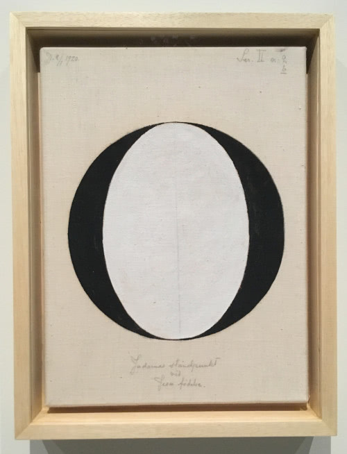
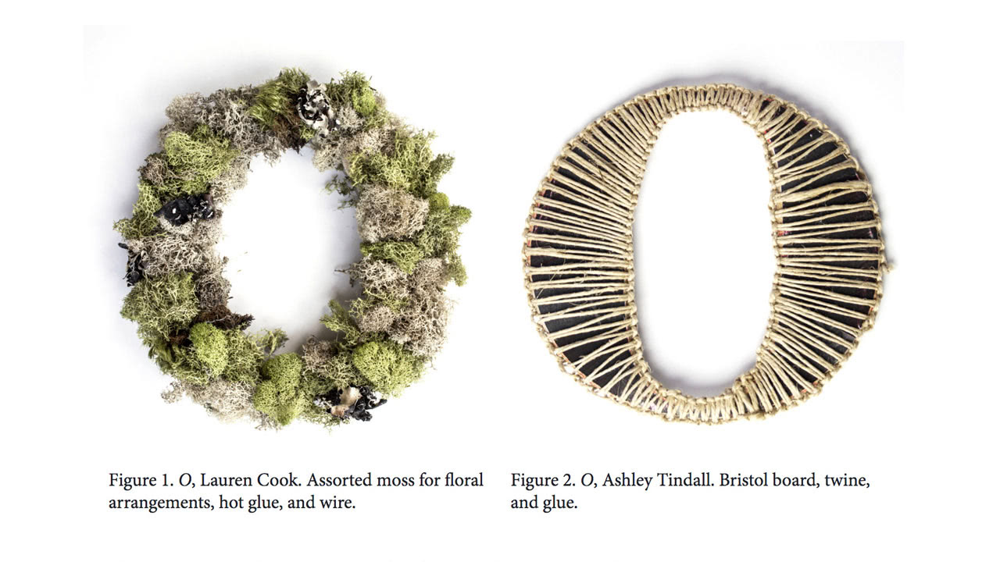
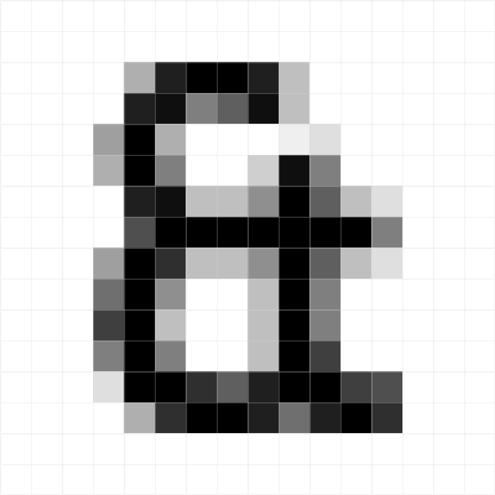

# Character & Description

- [Brief](#brief)
- [Details](#details)
- [Handoff](#handoff)
- [Examples](#examples)
- [Readings](#readings)
- [Resources](#resources)
- [Vocabulary](#vocabulary)

## Brief

> 90 percent of design is typography. And the other 90 percent is whitespace.
>
> —[Jeffrey Zeldman](https://twitter.com/zeldman/status/679727437198929921)



<cite>[Hilma af Klint](https://www.hilmaafklint.se/en/), Atom Series, 1919</cite> (via [coa.edu](https://www.coa.edu/live/profiles/1107-catherine-clinger/templates/details/faculty.php))

**Alt text:** `A large painted black serif capital letter O with a white oval center, on an off-white background.`

> Alternative text should be succinct, yet descriptive of the content and function of an image. Lengthy alternative text (more than around 100 characters) often indicates that extraneous content or content that is not available to sighted users is being presented.
>
> [Perceivable](https://webaim.org/standards/wcag/checklist#perceivable) guideline via WebAIM’s WCAG 2 Checklist

1. Design a bespoke character; working from the modern English alphabet, choose a single letterform from A to Z (one of 26 letters) using any style (lowercase or uppercase, sans-serif or serif, cursive or fantasy, etc.) and technique (analog or digital).
2. Write a concise, accessible, and semantic alternative text description of your final letterform artwork as a single sentence in under 120 characters.
    - For example: A close-up of a 16 point ampersand typed in Trebuchet MS viewed in Illustrator’s Pixel Preview mode.
3. Also consider text for a caption: Letter, designer, a list of materials or process, and year.
    - For example: *&*, Justin Gagne. Screenshot of an artboard in Adobe Illustrator. 2017

## Details

### Artwork

Capture and save final artwork in a digital format using these guidelines:

- Size: Use a square with a width and height of `1080 px` × `1080 px` at a resolution of `72 px` (think Instagram artwork size).
- Format: If it’s a photo, save as a JPG; and if it’s *not* a photo, save as a PNG; or if it’s animation or video, save as an animated GIF but consider including an alternative still frame as well.
- Name: Use a meaningful filename, in all-lowercase, and separate words with hyphens. See [Naming guidelines](https://developers.google.com/style/filenames) and <cite>[Dashes vs. underscores](https://www.mattcutts.com/blog/dashes-vs-underscores/)</cite> for details.
  - Use the filename convention of case, letter, first name initial followed by last name (surname) combined with the best practice of all-lowercase and separate words with hyphens.
    - For example: `uppercase-p-lsutnar.png`

**Note:**

- Keep artwork and text as separate pieces of content.

**Optional:**

- Collect and save sketches to document your process (as a case study).

### Text

- Write your description as a single sentence in sentence case; start with a capital letter and end with a period.
- Keep your description short; aim for 120 characters or less.

**Note:**

- Capitalize abbreviations and acronyms, but remove ampersands.
  - For example: The acronym (and brand) “C&A” becomes “C and A”.

## Handoff

Share a link to your work in the `01-character-description` channel in Slack.

### GitHub Config

- In *your* `english-for-designers` repo, create a folder with a Markdown and image file (within an `img` folder).
  - For example:
    - `01-character-description`
      - `index.md`
      - `img`
         - `uppercase-and-jgagne.png`

### Markdown Files

- `index.md`

```
# Character & Description


**Alt text:** A close-up of a 16 point ampersand typed in Trebuchet MS viewed in Illustrator’s Pixel Preview mode.

- - -

*&*, Justin Gagne. Screenshot of an artboard in Adobe Illustrator. 2017
```

### Artwork File Naming

- Use the filename convention of case, letter, first name initial followed by last name (surname).
  - For example: `uppercase-and-jgagne.png`

**Optional:**

For those with additional artwork (sketches) and text (information), please collate and show that work using basic Markdown to create subheading, lists, etc., as shown below.

```
# Character & Description


**Alt text:** A close-up of a 16 point ampersand typed in Trebuchet MS viewed in Illustrator’s Pixel Preview mode.

- - -

*&*, Justin Gagne. Screenshot of an artboard in Adobe Illustrator. 2017

## Process

### Sketches


Caption for sketch 1.

### Keywords

- ampersand
- bitmap
- pixel
- preview
- raster
```

## Examples

<details>
<summary>Analog: Play Instinct Letterforms</summary>



<p>Analog student work from <cite><a href="https://educators.aiga.org/wp-content/uploads/2013/12/hester">Experimental A–Z, 0–9</a></cite> taught by <a href="https://experimentaltypography.com/">Cassie Hester</a> and <a href="https://www.joeyhannaford.com">Joey Hannaford</a>.</p>
</details>

<details>
<summary>Digital: Once the 27th Letter of the Alphabet</summary>



<p><strong>Alt text:</strong> A close-up of a 16 point ampersand typed in Trebuchet MS viewed in Illustrator’s Pixel Preview mode.</p>

<hr>

<p><em>&</em>, Justin Gagne. Screenshot of an artboard in Adobe Illustrator. 2017</p>
</details>

## Readings

### Alt Text

- [How to Write Effective Alt Text](https://www.3playmedia.com/2019/12/27/alt-text-marketing/)
- [How to Write Great Alt Text — And Why It Matters](https://aceseditors.org/news/2020/how-to-write-great-alt-text-and-why-it-matters)
- [alt attributes like paragraphs](https://daverupert.com/2020/09/alt-attributes-like-paragraphs/)
- [Alt text is part of your site’s content](https://www.centercentre.com/2016/06/30/2016-06-30-alt-text-is-part-of-your-sites-content/)
- [When writing alt text, ask yourself this question](https://www.centercentre.com/2016/06/09/2016-06-09-when-writing-alt-text-ask-yourself-this-question/)
- [Alt-texts: The Ultimate Guide](https://axesslab.com/alt-texts/)
- [Include descriptive titles, captions, filenames, and text for images](https://support.google.com/webmasters/answer/114016?hl=en#descriptive-titles-captions-filenames)
- [Testing punctuation and markup for audible variances in screen readers](https://doublegreat.dev/listen/)
- [Accessible Drop Caps](https://adrianroselli.com/2019/10/accessible-drop-caps.html)

### Design

- [What is a Design Language… really?](https://medium.com/thinking-design/what-is-a-design-language-really-cd1ef87be793)

### Language

- [What Character Was Removed From The Alphabet?](https://www.dictionary.com/e/ampersand/)

### Markdown

- [Markdown Guide: Cheat Sheet](https://www.markdownguide.org/cheat-sheet/)
- [Mastering Markdown](https://guides.github.com/features/mastering-markdown/)

### Typography

- [Web Design is 95% Typography](https://ia.net/topics/the-web-is-all-about-typography-period)
- [Typography Deconstructed: Type Glossary](https://typedecon.com/blogs/type-glossary)
- [Totally Type](https://totallytype.com)
- [Creating a
Bespoke Typeface](https://raggededge.com/opinion/bespoke-typefaces-a-guide/)

## Resources

### Writing Tools

- [Hemingway Editor](https://www.hemingwayapp.com)

### Tutorials

- [Improving Image Accessibility With Alt Text](https://thegymnasium.com/take5/improving-image-accessibility-with-alt-text)
- [Writing Good Alt Text - HTTP 203](https://www.youtube.com/watch?v=flf2vS0IoRs)
- [Working & Collaborating in GitHub](https://english-for-designers-vskk.wistia.com/medias/sugdm6vb8z) (≈ 36 min)

## Vocabulary

- **Alt text**
  - Short for *alternative* text. Alternative text provides a descriptive textual alternative to non-text content such as images and charts in web pages and digital publishing formats.
- **Accessible**
  - Easily understood; approachable. Accessible content that’s friendly and usable by as many people as possible.
- **Bespoke**
  - Handmade; made by hand. Bespoke type can make a first impression count, and is often one of the first things people notice about a brand.
